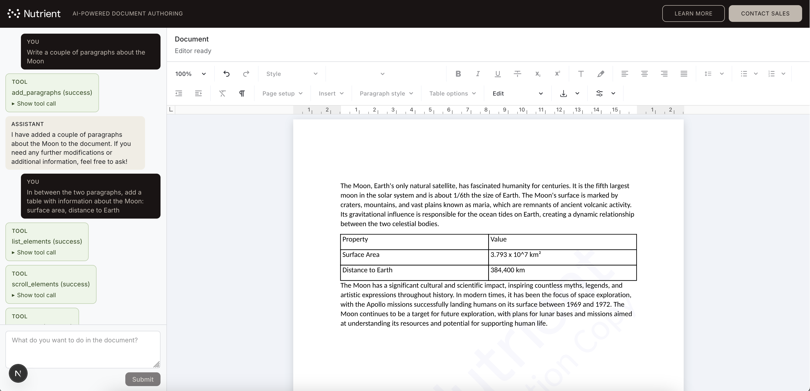

# Document Authoring AI Example

This example demonstrates an AI-assisted document editing workflow built with Next.js and `@nutrient-sdk/document-authoring`.



Please send all your feature requests and bug reports to support@nutrient.io.

## Getting Started

Configure OpenAI credentials first:

```shell
cp .env.sample .env.local
# Edit .env.local and set OPENAI_API_KEY
```

Then install and run:

```shell
# Install dependencies:
npm install
# Run in development mode:
npm run dev
```

Open [http://localhost:3000](http://localhost:3000).

## Going Into Production

For a production build:

```shell
npm run build
```

The production build can be run using:

```shell
npm run start
```

## More Information

For more information see `node_modules/@nutrient-sdk/document-authoring/README.md`.

## Environment Variables

`OPENAI_API_KEY` is required for AI-backed flows.

`DOCUMENT_AUTHORING_AI_EXAMPLE_OPENAI_MODEL` sets the OpenAI model used for the main assistant loop.
Possible values: any valid OpenAI model name string (for example `gpt-4o-mini`).
Default: `gpt-4o-mini`.

`DOCUMENT_AUTHORING_AI_EXAMPLE_OPENAI_REASONING_EFFORT` sets OpenAI reasoning effort for the main assistant loop.
Possible values: `none`, `minimal`, `low`, `medium`, `high`, `xhigh`.
Default: `medium`.
